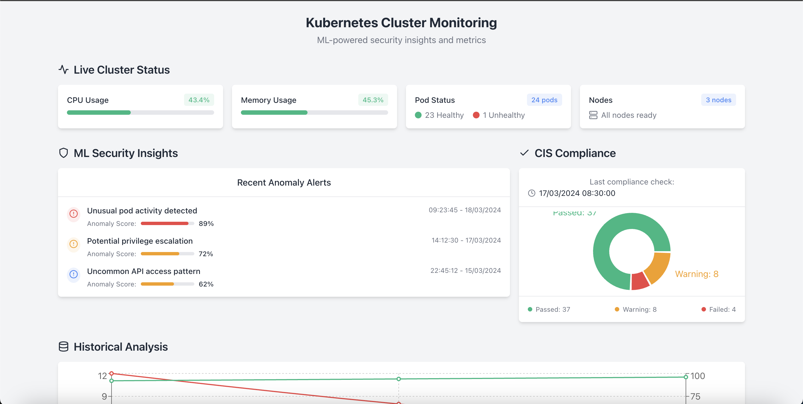

<div align="center">


<br/>

[](https://k8shield.netlify.app/)
[](https://www.irjet.net)
[](https://python.org)
[](https://aws.amazon.com)

<br/>

> **Real-time Kubernetes security monitoring with ML-based anomaly detection.**  
> Detects unauthorized access, unusual pod activity, and privilege escalation — at a glance.

</div>

---

## 📸 Dashboard



*Live cluster status · ML anomaly alerts with scores · CIS compliance · Historical analysis*

---

## 🎯 What it does

K8Shield watches your Kubernetes cluster and uses machine learning to catch threats that rule-based systems miss. It collects audit logs via Fluentd, runs them through Isolation Forest and K-Means models trained on AWS SageMaker, and surfaces everything on a live dashboard.

```
Kubernetes Cluster → Fluentd (audit logs) → Python processing → ML models → React dashboard
                                                                      ↓
                                                              AWS S3 (log storage)
```

---

## ✨ Key Features

| Feature | Details |
|---|---|
| 🔴 **Real-time monitoring** | Live CPU, memory, pod states, node status |
| 🤖 **ML anomaly detection** | Isolation Forest + K-Means · **92% threat detection accuracy** |
| 🚨 **Anomaly scoring** | Each alert has a confidence score (e.g. unusual pod activity: 89%) |
| 📈 **Historical analysis** | Trend visualization of security incidents over time |
| ✅ **CIS compliance** | Automated compliance checks — Passed / Warning / Failed breakdown |
| ☁️ **Cloud-native** | Runs on AWS EC2 + K3s, logs stored in S3 |

---

## 🛠 Tech Stack

<p>
  
</p>

| Layer | Technology |
|---|---|
| **Frontend** | React · Recharts |
| **Backend** | Python |
| **Log Collection** | Fluentd (Kubernetes audit logs) |
| **ML Models** | Isolation Forest · K-Means |
| **Training** | AWS SageMaker |
| **Storage** | AWS S3 |
| **Infra** | AWS EC2 · K3s |

---

## 📊 Results

```
Threat Detection Accuracy    ████████████████████░░  92%
Anomaly Types Detected       Unusual pod activity · Privilege escalation · API access anomalies
CIS Compliance (sample)      Passed: 37  ·  Warning: 8  ·  Failed: 4
```

---

## 🏗 Architecture

```
┌─────────────────────────────────────────────────────────┐
│                Kubernetes Cluster (K3s / EC2)           │
│   [Pod] [Pod] [Pod]  ──→  Fluentd  ──→  Audit Logs     │
└──────────────────────────────┬──────────────────────────┘
                               ▼
                    ┌──────────────────┐
                    │   AWS S3 Storage  │
                    └────────┬─────────┘
                             ▼
              ┌──────────────────────────┐
              │  Python Processing Layer  │
              │  · Log parsing           │
              │  · Feature extraction    │
              └──────────────┬───────────┘
                             ▼
              ┌──────────────────────────┐
              │    AWS SageMaker (ML)    │
              │  · Isolation Forest      │
              │  · K-Means Clustering    │
              └──────────────┬───────────┘
                             ▼
              ┌──────────────────────────┐
              │     React Dashboard      │
              │  · Live metrics          │
              │  · Security alerts       │
              │  · CIS compliance        │
              └──────────────────────────┘
```

---

## 🚀 Getting Started

```bash
# Clone the repo
git clone https://github.com/CosmicMicra/K8shield.git
cd K8shield

# Install frontend dependencies
npm install

# Start the dashboard
npm start
```

> **Note:** The full backend (Python + AWS SageMaker pipeline) runs on AWS infrastructure. The frontend is live at [k8shield.netlify.app](https://k8shield.netlify.app/)

---

## 📄 Publication

**K8Shield: Real-Time Kubernetes Security Monitoring using Machine Learning**  
*Soniya Phaltane (First Author) · IRJET Volume 11, Issue 9 · 2024*

---

## 👩‍💻 Author

**Soniya Phaltane** · [@CosmicMicra](https://github.com/CosmicMicra)  
ML Engineer · AI Security · [soniyaphaltane-portfolio.netlify.app](https://soniyaphaltane-portfolio.netlify.app)

---

<div align="center">
  <i>If you find this useful, leave a ⭐ — it helps!</i>
</div>
